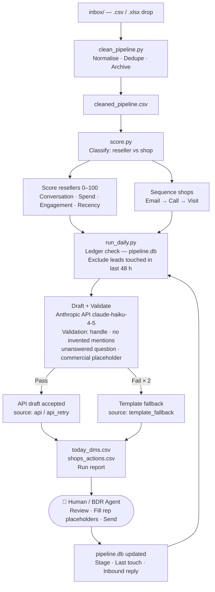

# Architecture

## System flow

## The loop

The human (or BDR agent) sits between the outputs and the ledger update: they review the drafted messages, fill in any `[rep: ...]` placeholders, and send. After sending, they update the lead's stage and last-touch date — either manually in the CSV or via a CRM sync — which feeds back into the ledger on the next run.

The 48-hour exclusion window in `run_daily.py` means the loop is safe to run daily without double-contacting: a lead that was actioned yesterday won't appear in today's output regardless of their score.

An AI agent can run the full pipeline autonomously up to the send step. The `[rep: ...]` placeholder pattern is the deliberate handoff point: anything the model cannot safely assert is left for a human to complete before the message goes out.
