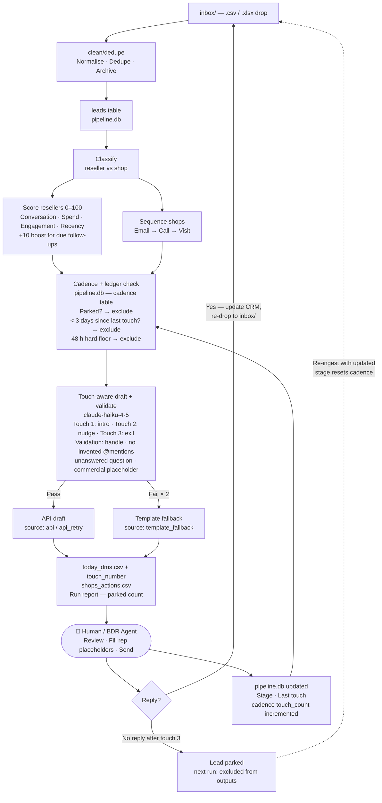

# Architecture

## System flow

## The cadence loop

The human (or BDR agent) sits between the outputs and the ledger update: they review drafted messages, fill in `[rep: ...]` placeholders, and send. After sending, the cadence table records the touch number and date. On the next run (3+ days later), eligible leads surface again with a tone-adapted draft — nudge on touch 2, graceful exit on touch 3.

If a lead replies, the rep updates their stage and `last_touch_date` in the CRM, re-exports the file to `inbox/`, and re-runs. The pipeline detects that the CRM date has advanced past our last automated touch and resets the touch count to zero, giving the lead a fresh sequence. This detection requires an updated ingest — without a `last_inbound_date` field in the source data, in-flight reply detection is not possible.

After touch 3 with no reply, the lead is parked on the following run and excluded from all future scoring and outputs unless re-ingested with a reply-indicating update. The run report shows how many leads were parked each day, providing a clean signal for pipeline health.
