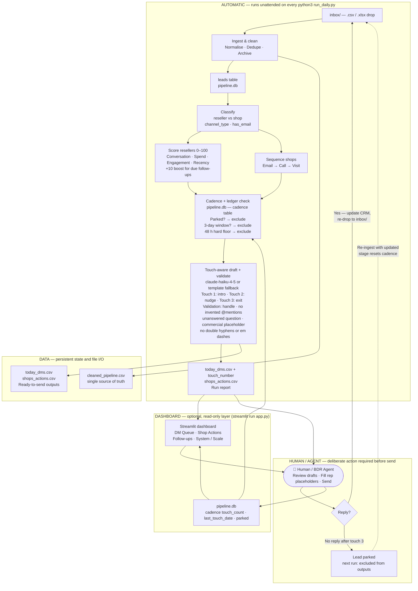

# Architecture

## System flow

## The three zones (plus an optional fourth)

**AUTOMATIC** covers everything that runs deterministically from a single command: ingest, clean, classify, score, apply cadence rules, draft, validate, and write outputs. No human decision is needed in this zone — the pipeline either succeeds or falls back to a safe template.

**DASHBOARD (optional)** is a read-only view layer on top of AUTOMATIC's outputs: `streamlit run app.py` reads `today_dms.csv`, `shops_actions.csv`, and `pipeline.db` and presents them as four browser tabs (DM Queue, Shop Actions, Follow-ups, System/Scale), with a sidebar that can trigger `run_daily.py` as a subprocess for click-through demos. It contains no pipeline logic of its own — it's a presentation layer, not a parallel implementation. **Terminal use and agent invocation do not require the dashboard**; everything it shows is equally available by opening the CSVs directly or reading the run report.

**HUMAN / AGENT** is the deliberate gate between automation and the customer, reached either via the raw CSVs or via the dashboard. A human (or BDR agent) reviews drafted messages, fills `[rep: ...]` placeholders with facts only they have access to (live pricing, stock levels, brand acceptance), and presses send. After sending they update the CRM and optionally re-ingest a reply, which resets the cadence automatically.

**DATA** holds all persistent state: `pipeline.db` (leads + cadence ledger), `cleaned_pipeline.csv` (master book), and the daily output CSVs. The AUTOMATIC zone reads from and writes to DATA; the DASHBOARD zone only reads from DATA; the HUMAN zone reads from DATA (via CSVs or the dashboard) and writes back to it (via CRM updates).

## The cadence loop

The human (or BDR agent) sits between the outputs and the ledger update: they review drafted messages, fill in `[rep: ...]` placeholders, and send. After sending, the cadence table records the touch number and date. On the next run (3+ days later), eligible leads surface again with a tone-adapted draft — nudge on touch 2, graceful exit on touch 3.

If a lead replies, the rep updates their stage and `last_touch_date` in the CRM, re-exports the file to `inbox/`, and re-runs. The pipeline detects that the CRM date has advanced past our last automated touch and resets the touch count to zero, giving the lead a fresh sequence. This detection requires an updated ingest — without a `last_inbound_date` field in the source data, in-flight reply detection is not possible.

After touch 3 with no reply, the lead is parked on the following run and excluded from all future scoring and outputs unless re-ingested with a reply-indicating update. The run report shows how many leads were parked each day, providing a clean signal for pipeline health.

## Where an agent could replace the human — and where it deliberately shouldn't

An agent could automate the **send** step for resellers whose drafts contain no `[rep: ...]` placeholders and pass all validation checks — these are structurally complete messages that require no human completion, making auto-send low-risk. An agent could also handle the **CRM update** step: detect an inbound DM reply via an API hook, update the lead's stage and `last_touch_date`, and drop the updated file into `inbox/` automatically, closing the reply-reset loop without manual re-export.

The **placeholder-filling** step should deliberately stay human. The `[rep: ...]` markers exist precisely because the model doesn't have access to Fleek's live pricing, brand acceptance list, or stock levels — letting an agent invent values here would route factually incorrect information to leads, which is the failure mode the validation layer is designed to prevent.
